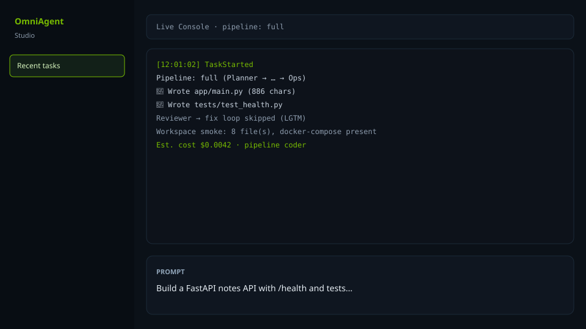
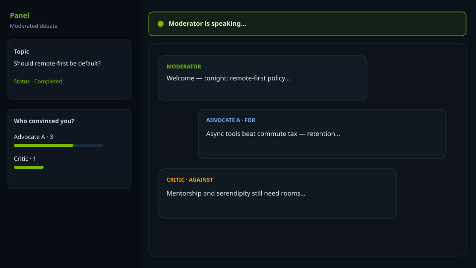

# OmniAgent Console

**Multi-agent AI studio** for coding pipelines and **moderated panel debates**.

**.NET 10** API + Worker · **Angular 21** UI · **Docker Compose** · OpenAI-compatible LLMs (**NVIDIA NIM** by default)

[Features](#features) · [Quick start](#quick-start) · [Use cases](#use-cases) · [Architecture](#architecture) · [Docs](#documentation) · [Changelog](CHANGELOG.md)

[](LICENSE)
[](https://dotnet.microsoft.com/)
[](https://angular.dev/)
[](https://docs.docker.com/compose/)
[](https://github.com/yamaninko/omni-agent-console/releases)

### Screenshots

| Studio | Panel |
|--------|--------|
|  |  |

### What it does

1. **Studio** — prompt → agent chain **Planner → Research → Coder → Reviewer → Ops** (optional Reviewer→Coder fix loop). Coder uses a tool loop (`write_file` / `read_file` / `list_files` / sandboxed `run_terminal`) into `workspace/`.
2. **Panel** — **Agent Groups** of personas (moderator + For/Against) debate a topic with floor timer, live stream, votes, inject, transcripts.

Pipelines: `full` | `coder` | `plan-code-review`. UI language: **EN / TR**. Shared classroom mode: `SHARED_LAB=true`.

### Türkçe özet

Çoklu ajanlı stüdyo: kod pipeline’ı ve moderasyonlu AI panelleri. .NET 10 + Angular 21 + Docker. OpenAI-uyumlu API (NVIDIA NIM). Sınıf için shared-lab; öğrenci kotası ve şablon cast kopyalama desteklenir.

---

## Features

| Area | Highlights |
|------|------------|
| **Coding studio** | Multi-agent pipeline, tool loop, skills auto-suggest, presets, cost budget, workspace runner |
| **Debate panel** | Groups, roles/stances, templates, multi-round, inject, vote, scorecard, ZIP export, STT/TTS |
| **Models** | NIM catalog sync, per-agent fallbacks, estimated cost |
| **Lab** | Session isolation, student nav, quotas, instructor templates + live dashboard cancel |
| **Ops** | RabbitMQ at-least-once, Redis cancel/console, Vault + file secret mirror |
| **Security** | Console API key, path guard, secret redaction, loopback infra ports |
| **DX** | `make smoke` / `make smoke-e2e`, CI unit tests, Playwright smoke |

---

## Quick start

**Requirements:** Docker Desktop (local .NET/Node optional if you only use Compose).

```bash
git clone https://github.com/yamaninko/omni-agent-console.git
cd omni-agent-console
cp .env.example .env
# set OMNIAGENT_API_KEY=...
docker compose up -d --build
```

| Service | URL |
|---------|-----|
| UI | http://localhost:4210 |
| API health | http://localhost:5080/health |
| RabbitMQ UI | http://localhost:15673 |
| Vault | http://localhost:8201 |

1. **Settings** → paste API key → Save (or bootstrap via `.env`).
2. **Home** → sample debate cast **or** Studio preset.
3. **Existing project:** Workspace → pick folder → **Open in Studio**, *or* Studio → project dropdown → enable “Work on this existing project” → prompt → Run.
4. **Groups** → cast (Mark as template for lab) → **Panel** → Start.
5. Optional: `PANEL_FLOOR_MODE=llm` for model-driven speaker order.

```bash
make smoke              # panel API smoke (key + ≥1 group)
make smoke-e2e          # Playwright UI smoke (system Chrome)
make test-be test-fe    # unit tests
```

---

## Use cases

- **Local multi-agent coding lab** — multi-file APIs/apps with skills and Docker packaging.
- **Classroom (shared-lab)** — one host, session workspaces, student quotas, instructor templates.
- **Moderated AI debate** — fixed roster, stances, inject/vote/transcript.
- **Provider experiments** — catalog sync, fallback chains under free-tier load.

---

## Architecture

```text
Browser (Angular 21)
    │  HTTP + SignalR
    ▼
API  ──Redis──►  Worker (orchestrator / panel)
    │                 │
    ▼                 ▼
Postgres          LLM providers (OpenAI-compatible)
RabbitMQ · Vault · workspace volume
```

- **Worker** runs Studio tasks and panel sessions (queue kinds `task-run` / `panel-session`).
- **At-least-once** RabbitMQ: shutdown NACK/requeue; user cancel ACK; poison-message guard.
- **Cross-process cancel** via Redis `task-cancellations`.
- **Coder tool loop**: filesystem tools under `WorkspacePathGuard`; optional whitelist terminal for tests.
- **Shared-lab**: session-scoped tasks/workspaces; config writes admin-gated; group **clone** open to students.

Detailed history: [AGENT.md](AGENT.md) · [docs/ROADMAP.md](docs/ROADMAP.md).

### Project layout

```text
backend/src/OmniAgentConsole.Api             # REST, SignalR, middleware
backend/src/OmniAgentConsole.Application     # DTOs, policies, tools
backend/src/OmniAgentConsole.Domain          # Entities
backend/src/OmniAgentConsole.Infrastructure  # EF, queue, providers, runtime
backend/src/OmniAgentConsole.Worker          # Queue consumer
backend/tests/OmniAgentConsole.UnitTests
frontend/                                    # Angular 21
workspace/                                   # agent outputs (gitignored)
```

### Recommended models (NVIDIA NIM free tier)

| Agent | Model (example) | Notes |
|-------|-----------------|--------|
| Coder | `deepseek-ai/deepseek-v4-flash` | Tool calling |
| Planner / Reviewer | `openai/gpt-oss-120b` | Plan & review |
| Research | `nvidia/nemotron-3-super-120b-a12b` | Context |
| Ops | `meta/llama-3.1-8b-instruct` | Short summaries |

Configure chains on the **Agents** page; Sync from NVIDIA imports the live catalog. Fallbacks apply on timeout/404/rate-limit (not 401).

### Deployment profiles

| Profile | Env | Isolation |
|---------|-----|-----------|
| Laptop (default) | `SHARED_LAB=false` | Single user |
| Shared lab | `SHARED_LAB=true` + `CONSOLE_API_KEY` | Session tasks/workspaces; student nav + quotas |

Infra ports default to `127.0.0.1` (`INFRA_BIND_ADDRESS`).

---

## Documentation

| Doc | Purpose |
|-----|---------|
| [CHANGELOG.md](CHANGELOG.md) | Release history |
| [docs/ROADMAP.md](docs/ROADMAP.md) | Decisions & backlog |
| [docs/PUBLISH_CHECKLIST.md](docs/PUBLISH_CHECKLIST.md) | SEO / blog / About |
| [docs/GITHUB_SEO.md](docs/GITHUB_SEO.md) | Topics + description paste |
| [docs/RELEASE_NOTES_v0.1.0.md](docs/RELEASE_NOTES_v0.1.0.md) | v0.1.0 notes |
| [SECURITY.md](SECURITY.md) | Vulnerability reporting |
| [CONTRIBUTING.md](CONTRIBUTING.md) | Dev setup & PRs |
| In-app **Docs** | User + architecture guides |

---

## Configuration notes

```bash
cp .env.example .env
```

- **OMNIAGENT_API_KEY** — provider key (also seedable from Settings).
- **CONSOLE_API_KEY** — required when `SHARED_LAB=true`.
- **PANEL_FLOOR_MODE** — `fixed` (default) or `llm`.
- Shared-lab quotas: `SHARED_LAB_MAX_CONCURRENT_TASKS`, `SHARED_LAB_MAX_TASKS_PER_DAY`, `SHARED_LAB_MAX_DAILY_TOKENS`.

Secrets: HashiCorp Vault + durable mirror under `./data/secrets` (gitignored).

---

## License

[MIT](LICENSE)
